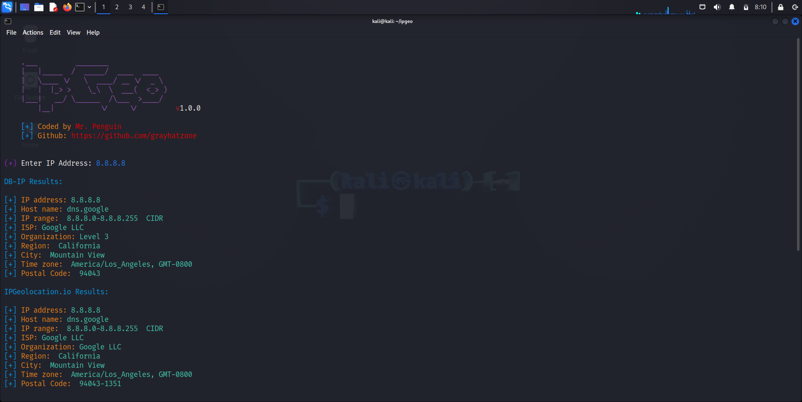

# ipgeo
simple script to get ip geolocation information from check-host.net

# Screenshot

# Install
<pre>
  <code>
    git clone https://github.com/grayhatzone/ipgeo.git
    cd ipgeo
    chmod +x ipgeo && ./ipgeo
  </code>
</pre>
